# aBaja 2026 — Software Virtual World

> **New to all this?** Don't worry. This guide walks you through every step from scratch — no prior RoadRunner or Simulink experience needed.

---

## Table of Contents

1. [GitHub Repositories](#github-repositories)
2. [Prerequisites](#prerequisites)
3. [Step 1 — Clone the Repositories](#step-1--clone-the-repositories)
4. [Step 2 — Create a RoadRunner Project](#step-2--create-a-roadrunner-project)
5. [Step 3 — Learn RoadRunner (Tutorials)](#step-3--learn-roadrunner-tutorials)
6. [Step 4 — Create a Scene](#step-4--create-a-scene)
7. [Step 5 — Add Vehicles and Build a Scenario](#step-5--add-vehicles-and-build-a-scenario)
8. [Step 6 — Export the Scene as USD](#step-6--export-the-scene-as-usd)
9. [Step 7 — Open the MATLAB Project](#step-7--open-the-matlab-project)
10. [Step 8 — Link RoadRunner to MATLAB](#step-8--link-roadrunner-to-matlab)
11. [Step 9 — Configure the Simulation Script](#step-9--configure-the-simulation-script)
12. [Step 10 — Learn Simulink (Tutorial)](#step-10--learn-simulink-tutorial)
13. [Step 11 — Open and Understand the Simulink Model](#step-11--open-and-understand-the-simulink-model)
14. [Step 12 — Set the USD Scene Path in Simulink](#step-12--set-the-usd-scene-path-in-simulink)
15. [Step 13 — Compile the Model](#step-13--compile-the-model)
16. [Step 14 — Simulation Modes](#step-14--simulation-modes)
17. [Step 15 — Attach the Simulink Algorithm to RoadRunner (SLbehaviour)](#step-15--attach-the-simulink-algorithm-to-roadrunner-slbehaviour)
18. [Step 16 — Run the Simulation](#step-16--run-the-simulation)
19. [Running the Mandatory Scenarios](#running-the-mandatory-scenarios)
20. [Python Integration in Simulink](#python-integration-in-simulink)
21. [Resources & Further Learning](#resources--further-learning)
22. [Getting Help](#getting-help)

---

## GitHub Repositories

All project code lives on GitHub under the **aBaja-2026** organisation: [https://github.com/aBaja-2026](https://github.com/aBaja-2026)

| Repository | Purpose |
|---|---|
| [SoftwareVirtualWorldSimulation](https://github.com/aBaja-2026/SoftwareVirtualWorldSimulation) | MATLAB / Simulink model — this is the skeleton you build your algorithm on |
| [SoftwareVirtualWorldScenarios](https://github.com/aBaja-2026/SoftwareVirtualWorldScenarios) | Mandatory and suggested RoadRunner scenarios (`.rrscene` / `.rrscenario` files) |

---

## Prerequisites

Before you start, download and install the following:

| Software | Where to get it |
|---|---|
| **MATLAB, Simulink, and RoadRunner** | [MathWorks Downloads](https://uk.mathworks.com/downloads/) |
| **RoadRunner installation & activation guide** | [Install and Activate RoadRunner](https://www.mathworks.com/help/roadrunner/ug/install-and-activate-roadrunner.html) |
| **Git** | [https://git-scm.com](https://git-scm.com) |

> **Tip:** Make sure you have an active MathWorks licence that includes RoadRunner and Simulink before proceeding.

---

## Step 1 — Clone the Repositories

Open a terminal (Command Prompt on Windows, Terminal on macOS/Linux) and navigate to an **empty folder** where you want to keep the project. Then clone both repositories:

```bash
git clone https://github.com/aBaja-2026/SoftwareVirtualWorldSimulation
git clone https://github.com/aBaja-2026/SoftwareVirtualWorldScenarios
```

You should see output similar to this — both repositories being downloaded:

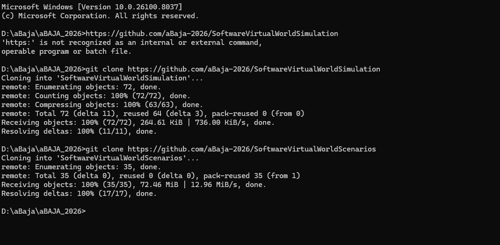

> **What you now have:**
> - `SoftwareVirtualWorldSimulation/` — contains the MATLAB project and Simulink model
> - `SoftwareVirtualWorldScenarios/` — contains the mandatory scenario files

---

## Step 2 — Create a RoadRunner Project

RoadRunner stores all your scenes, scenarios, and exported assets inside a **Project** folder. You need to create one before you can do anything else.

1. Open **RoadRunner**
2. On the start screen, click **New Project**
3. Select an **empty folder** and give it a meaningful name (e.g. `aBaja_RR_Project`)
4. Click **OK** / **Create**

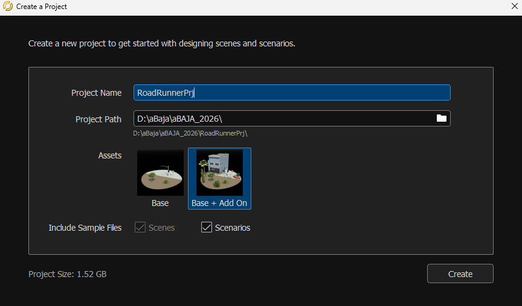

> **Tip:** Keep your RoadRunner project folder separate from your cloned Git repositories. A good structure looks like:
> ```
> D:\aBaja\aBaja_2026\
> ├── SoftwareVirtualWorldSimulation\   ← cloned repo
> ├── SoftwareVirtualWorldScenarios\    ← cloned repo
> └── aBaja_RR_Project\                 ← your new RoadRunner project
>     ├── Assets\
>     ├── Exports\
>     ├── Project\
>     ├── Scenarios\
>     └── Scenes\
> ```

---

## Step 3 — Learn RoadRunner (Tutorials)

If you haven't used RoadRunner before, spend some time with these free official tutorials before moving on. They cover everything from drawing roads to building full scenarios:

| Tutorial | Link |
|---|---|
| RoadRunner Scene Editing | [RoadRunner Tutorial – MathWorks](https://www.mathworks.com/solutions/automated-driving/roadrunner-tutorial.html) |
| RoadRunner Scenario Editing | [RoadRunner Scenario Tutorial – MathWorks](https://in.mathworks.com/solutions/automated-driving/roadrunner-scenario-tutorial.html) |

---

## Step 4 — Create a Scene

A **Scene** is the environment (roads, buildings, terrain). A **Scenario** is the traffic and events that happen on top of that environment. You need to create the scene first.

### 4a — Open a New Scene

In RoadRunner, go to **File → New Scene** (or use the Scene tab if you see it):

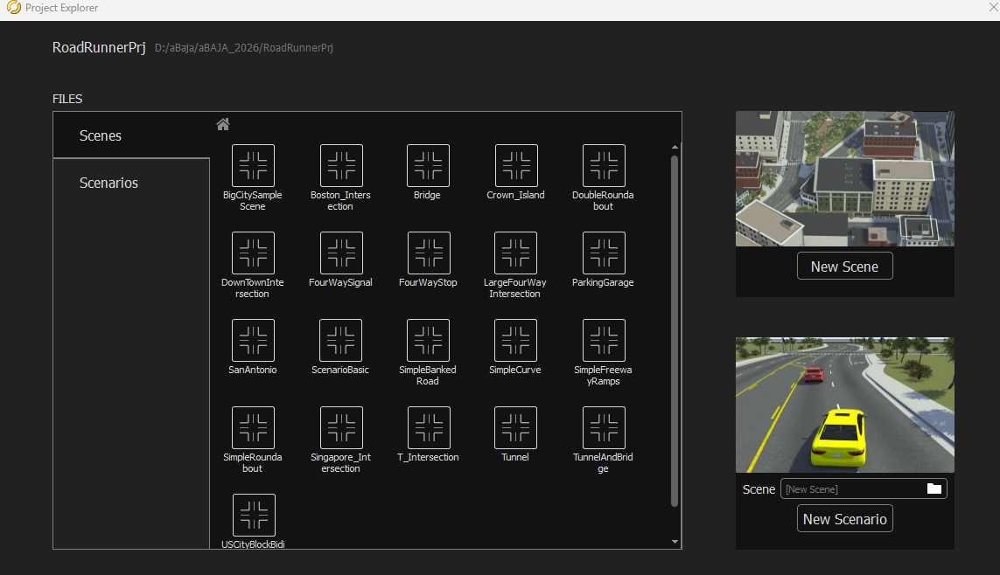

### 4b — Draw a Road

Select the **Road Plan tool** from the toolbar. **Right-click** on the map to place points — each click adds a node and RoadRunner automatically draws road segments between them:

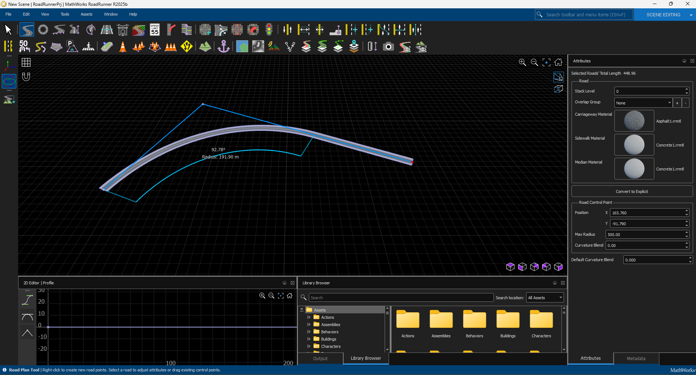

> **Tip:** Zoom in and out with the scroll wheel. Pan by holding the middle mouse button. Right-click existing nodes to move or delete them.

### 4c — Set the Direction of Travel (Left-Hand Drive)

If you need **left-hand drive** (e.g. for UK or India), you need to reverse the lane directions:

1. Select the **Lane tool** from the toolbar
2. Click on the road you want to change
3. In the left-hand properties panel, click the **"Reverse Lane Direction"** button

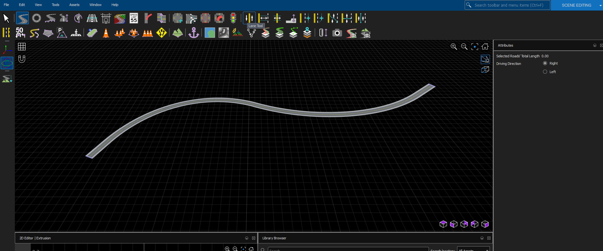

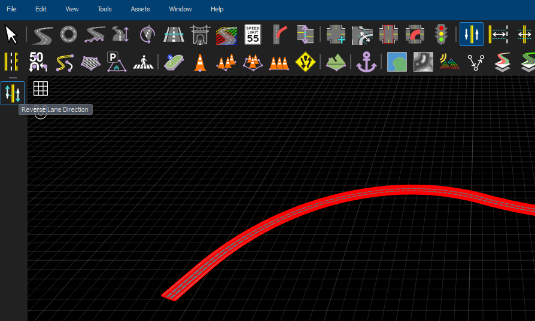

### 4d — Save the Scene

Go to **File → Save** and save the scene file (e.g. `myScene.rrscene`).

---

## Step 5 — Add Vehicles and Build a Scenario

Now switch to the **Scenario** editing environment to add vehicles and define how they move.

### 5a — Switch to the Scenario Tab

Click on the **Scenario** tab at the top of the RoadRunner window:

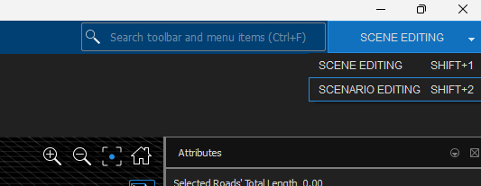

### 5b — Add a Vehicle

Open the **Library Browser** panel (usually on the right side). Find a vehicle, then **drag and drop** it onto the road:

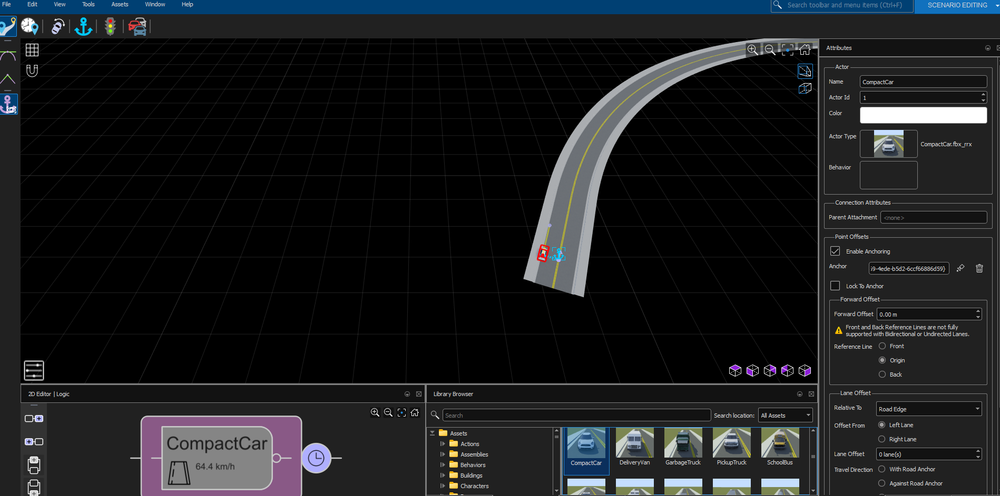

> **What is the Ego Vehicle?** In the context of this project, the **Ego Vehicle** (Actor ID = 1) is the car that your Simulink algorithm will control. All other vehicles are "traffic" vehicles that follow pre-defined paths.

### 5c — Add Waypoints to a Vehicle

Waypoints tell a vehicle where to drive. To add waypoints:

1. Click on a vehicle to select it
2. **Right-click** on any point on the road
3. Select **"Add Waypoint"** from the context menu
4. Repeat to add more points along the desired path

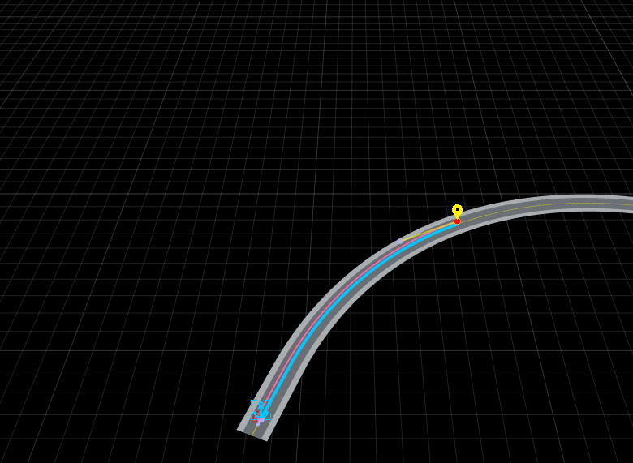

> **Tip:** Add multiple waypoints in sequence to create a smooth driving path. The vehicle will follow them in order.

### 5d — Add More Vehicles and Use the Logic Editor

You can drag-drop additional vehicles from the Library Browser. Use the **Logic Editor** to add conditions and triggers (e.g. a vehicle cuts in when the ego vehicle gets within 20 m). Refer to the [RoadRunner Scenario Tutorial](https://in.mathworks.com/solutions/automated-driving/roadrunner-scenario-tutorial.html) for detailed guidance on the Logic Editor:

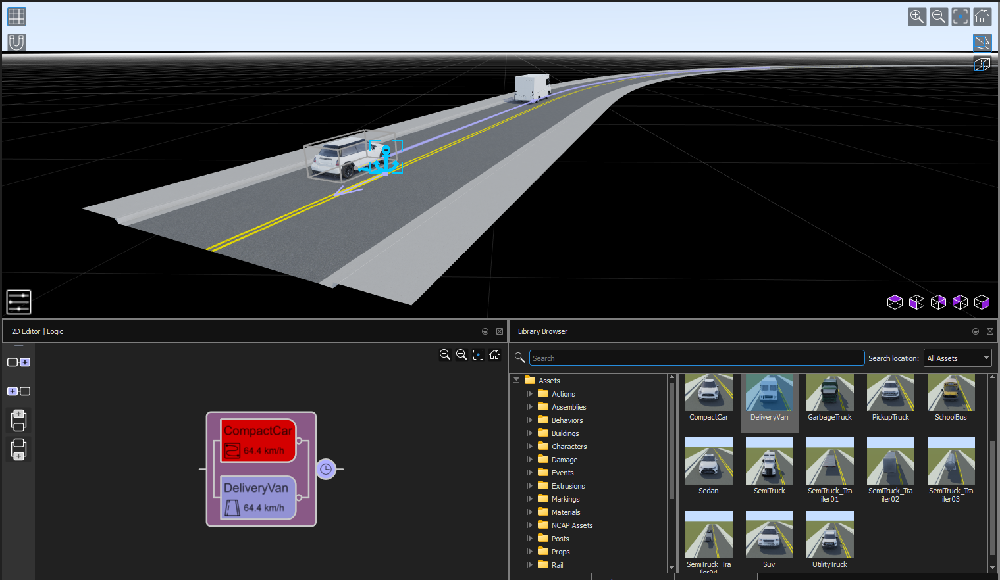

### 5e — Save the Scenario

Go to **File → Save Scenario** and save with a matching name (e.g. `myScenario.rrscenario`). Both the scene and scenario files should share the same base name.

---

## Step 6 — Export the Scene as USD

The Simulink 3D visualisation engine reads scenes in **USD (Universal Scene Description)** format. You need to export your scene from RoadRunner before Simulink can display it.

### 6a — Switch Back to the Scene Window

Make sure you are in the **Scene Editing** window (not Scenario).

### 6b — Export

Go to **File → Export → USD**:

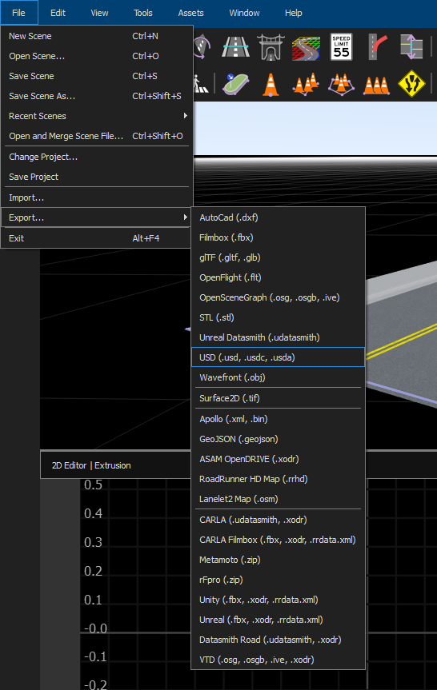 Export > USD with export options"/>

Use the following recommended export settings:

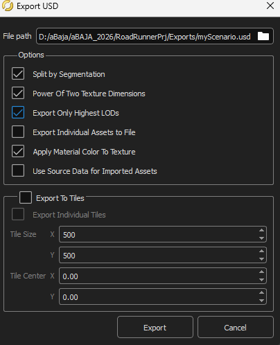

### 6c — Note the Export Path

After exporting, RoadRunner will create a folder containing `.usd`, `.usdc`, or `.usda` files along with `.rrdata.xml` and `.xodr` metadata files. **Remember the full path to this folder** — you will need it in Step 12.

> **Example export path:** `D:\aBaja\aBaja_RR_Project\Exports\myScene_usd\`

> **Important:** After exporting, **close RoadRunner** and save all your work before continuing.

---

## Step 7 — Open the MATLAB Project

1. Open **MATLAB**
2. In the MATLAB file browser, navigate to your cloned `SoftwareVirtualWorldSimulation` folder
3. Double-click **`SoftwareVirtualWorldSimulation.prj`** to open the project

Opening the `.prj` file is important — it automatically adds all the necessary folders to the MATLAB path and runs the required setup steps.

---

## Step 8 — Link RoadRunner to MATLAB

RoadRunner must always be **launched from MATLAB** (not by opening RoadRunner directly) in order for the co-simulation to work correctly.

### First-time setup only

Run the following in the MATLAB Command Window:

```matlab
rrApp = roadrunnerSetup;
```

When prompted, navigate to and select the **RoadRunner Project folder** — this is the folder that contains the `Assets`, `Exports`, `Project`, `Scenarios`, and `Scenes` sub-folders:

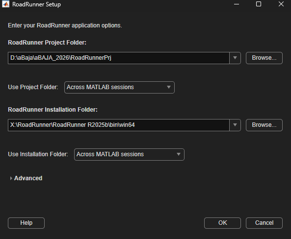

> **You only need to do this once.** After the first time, RoadRunner will remember the project path.

---

## Step 9 — Configure the Simulation Script

Open **`setupSimulation.mlx`** (in the root of the `SoftwareVirtualWorldSimulation` folder). This MATLAB Live Script is the main configuration interface for the simulation.

In the script, find the **Scenario Name** dropdown and add/select the scenario you created in Step 5:

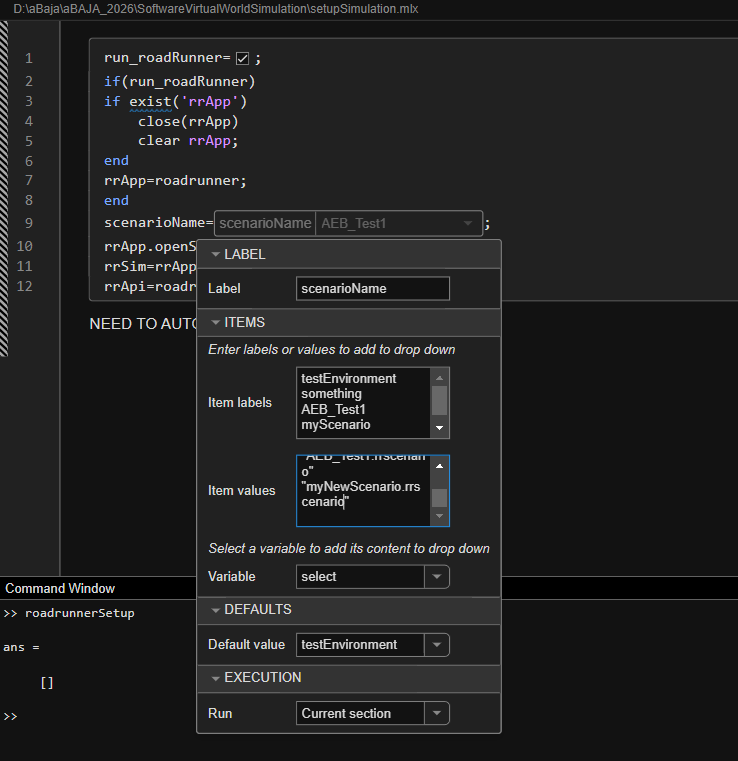

> **Important:** The "Re-launch RoadRunner" checkbox launches RoadRunner from MATLAB.
> - **First time:** Keep it **checked** so RoadRunner opens.
> - **Subsequent runs:** **Uncheck it** — you only need to launch RoadRunner once per MATLAB session. Re-launching it every time wastes time and can cause connection errors.

---

## Step 10 — Learn Simulink (Tutorial)

If you're new to Simulink, this free 1-hour self-paced course is an excellent starting point before you dive into the model:

[Simulink Onramp — MathWorks Academy](https://matlabacademy.mathworks.com/details/simulink-onramp/simulink)

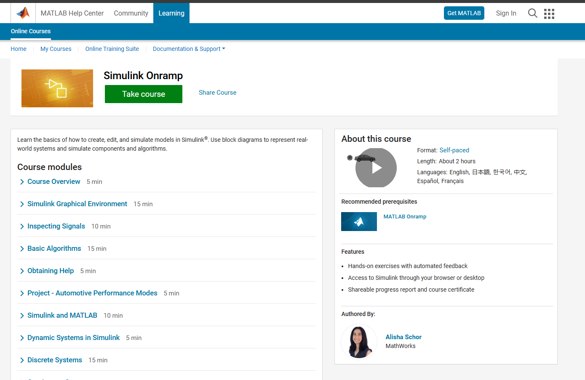

---

## Step 11 — Open and Understand the Simulink Model

In the MATLAB file browser, go to the `Models` folder and open **`aBaja2026.slx`**.

The model should look like this:

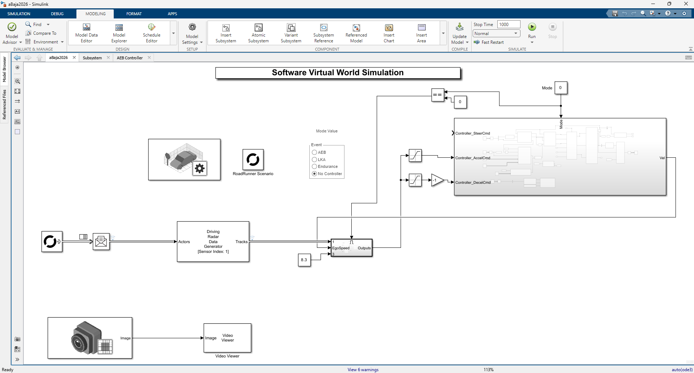

**Key blocks you will interact with:**

| Block | What it does |
|---|---|
| **Simulation 3D Scene Configuration** | Connects Simulink to the RoadRunner USD scene for 3D visualisation |
| **Ego Vehicle** | Receives control signals (steering, throttle, brake) from your algorithm |
| **AEB / LKA / Endurance / No Controller** | Mode selector — determines which part of the vehicle your algorithm controls |

---

## Step 12 — Set the USD Scene Path in Simulink

This is a **critical step** that is easy to miss. Simulink needs to know where your exported USD scene is located in order to render the 3D visualisation.

1. **Double-click** on the **Simulation 3D Scene Configuration** block in the model
2. In the block parameters dialog, find the **"Project"** field
3. Set it to the **full path of the folder** where you exported the USD scene in Step 6

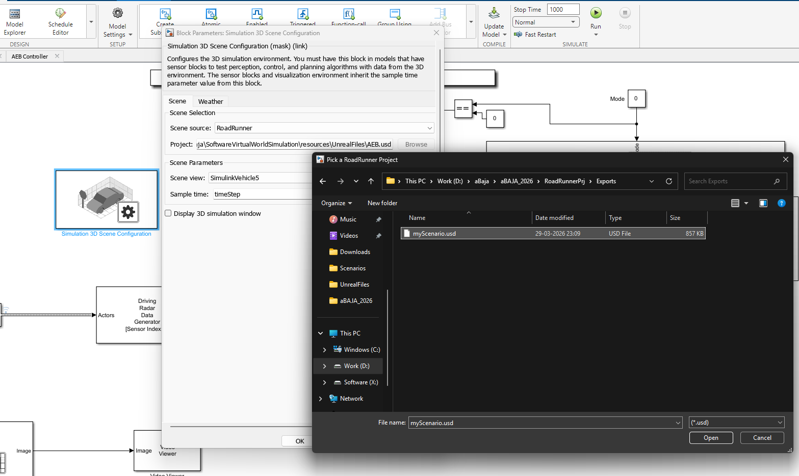

> **You must repeat this step every time you use a scene exported to a different folder.** For example, when switching from `myScene` to `AEB_scene`, update this path to point to the new USD export folder.

> **What files does Simulink need?** The USD export folder should contain:
> - `.usd`, `.usdc`, or `.usda` — the 3D scene geometry
> - `.rrdata.xml` — RoadRunner metadata (required for sensor simulation)
> - `.xodr` — road network data (required for lane detection)
>
> If any of these files are missing, re-export from RoadRunner with the correct settings.

---

## Step 13 — Compile the Model

Before running, you must **compile** the Simulink model to check for errors:

- Press **Ctrl+D**, or
- Go to **Modeling → Update Model** in the Simulink toolbar

After compiling, you should see **no errors** in the Diagnostics panel. If there are errors, check:
- Is the USD path from Step 12 set correctly?
- Did you open the `.prj` file in Step 7?
- Is RoadRunner running and connected (launched via `roadrunnerSetup`)?

---

## Step 14 — Simulation Modes

The Simulink model supports four simulation modes. Each mode is designed for a different event in the Software Virtual World round:

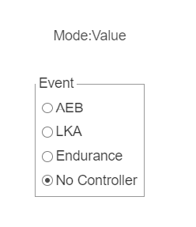

| Mode | Lateral Control | Longitudinal Control | Use case |
|---|---|---|---|
| **AEB** (Autonomous Emergency Braking) | Simulation (default) | **Your algorithm** | Test emergency braking logic |
| **LKA** (Lane Keeping Assist) | **Your algorithm** | Simulation (default) | Test lane-keeping logic |
| **Endurance** | **Your algorithm** | **Your algorithm** | Full autonomous driving — both axes |
| **No Controller** | Simulation (default) | Simulation (default) | Verify the vehicle follows the pre-defined RoadRunner path correctly |

> **Start with "No Controller"** when setting up a new scenario. If the vehicle follows the RoadRunner waypoints correctly in this mode, your setup is working. Then switch to your target mode to test your algorithm.

---

## Step 15 — Attach the Simulink Algorithm to RoadRunner (SLbehaviour)

In order for Simulink to actually control the Ego Vehicle in RoadRunner, you need to create a special behaviour called **SLbehaviour** and attach it to the Ego Vehicle. This tells RoadRunner that "the Simulink model will drive this vehicle."

> **Before you start:** Make sure the **Ego Vehicle** in your RoadRunner Scenario has **Ego Actor ID = 1**.

### 15a — Create a New Behaviour

In **RoadRunner Scenario**, go to the Behavior panel (or the behaviour library) and click to **Create a New Behavior**:

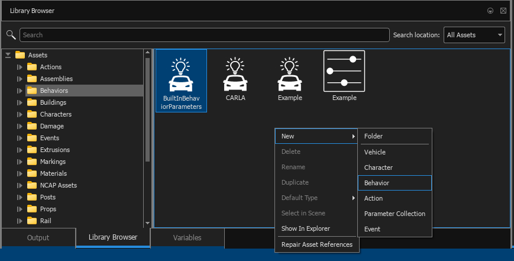

### 15b — Configure the Behaviour

A new behaviour dialog will open. Set it up as follows:

- **Name:** `SLbehaviour`
- **Platform:** `MATLAB/Simulink`
- **File name:** `aBaja2026.slx` *(this is the Simulink model file that contains your algorithm)*

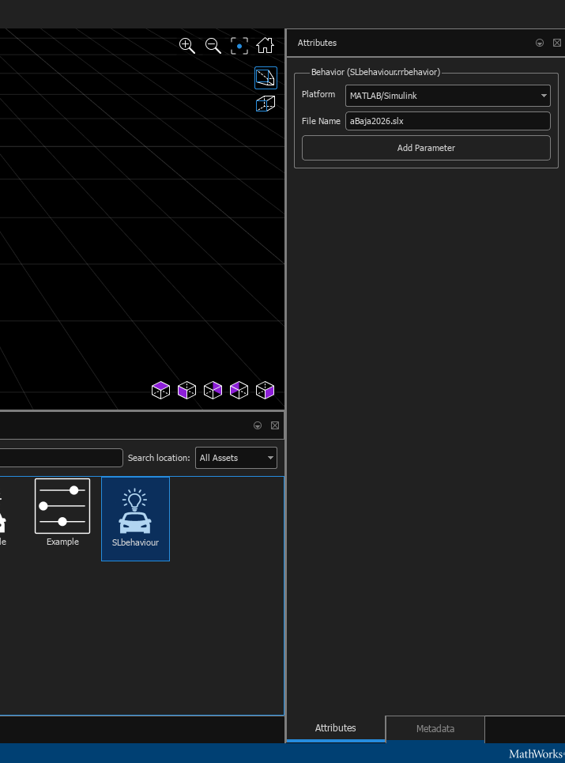

> **Why does this work?** When RoadRunner sees the `MATLAB/Simulink` platform, it establishes a co-simulation connection. At run time, RoadRunner sends sensor data to Simulink and Simulink sends back control commands (steering, throttle, brake) to move the Ego Vehicle.

### 15c — Attach the Behaviour to the Ego Vehicle

Click on the **Ego Vehicle** in the scenario to select it. Then, in the properties panel, assign the `SLbehaviour` you just created to this vehicle:

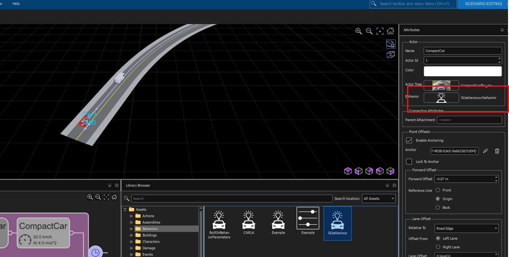

---

## Step 16 — Run the Simulation

Once the SLbehaviour is attached to the Ego Vehicle, you are ready to run.

1. In RoadRunner, switch to the **Simulation** tab
2. Click the **Play** button:

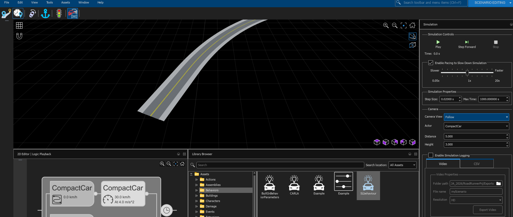

**What should happen:**

1. RoadRunner sends a signal to MATLAB/Simulink
2. The Simulink model (`aBaja2026.slx`) begins **compiling** automatically
3. Once compiled, the Ego Vehicle in RoadRunner starts moving along the path you defined
4. A **camera/sensor visualisation window** should also appear in Simulink

> **This means the setup is working correctly.** If the Ego Vehicle moves and you see the camera window, your environment is configured properly and you can start developing your algorithm.

> **If the simulation doesn't start:** Check the MATLAB Command Window for error messages. Common issues:
> - RoadRunner was not launched from MATLAB (re-run `roadrunnerSetup`)
> - The USD path in the Simulation 3D Scene Configuration block is wrong (check Step 12)
> - The model was not compiled without errors (check Step 13)

---

## Running the Mandatory Scenarios

The `SoftwareVirtualWorldScenarios` repository contains pre-built mandatory scenarios (e.g. `AEB.rrscene`, `AEB.rrscenario`). Follow these steps to run them:

> **Before you start:** You only need to create the **SLbehaviour** once per RoadRunner project (Step 15). You do not need to recreate it for each scenario.

### Step-by-Step

**1.** Copy the scenario files into your RoadRunner project:
   - Copy `*.rrscene` files → `<YOUR_RR_PROJECT>/Scenes/`
   - Copy `*.rrscenario` files → `<YOUR_RR_PROJECT>/Scenarios/`

**2.** In RoadRunner, go to **File → Open Scene** and open `AEB.rrscene`

**3.** Export the scene as USD (File → Export → USD) as described in Step 6

**4.** In Simulink, update the **Simulation 3D Scene Configuration** block path to point to the new USD export folder (Step 12)

**5.** Back in RoadRunner, switch to the **Scenario** tab, then go to **File → Open Scenario into Current Scene** and open `AEB.rrscenario`

**6.** Select the **Ego Vehicle** and attach the `SLbehaviour` to it (as in Step 15c)

**7.** Go to the **Simulation** tab and click **Play**

   ✅ You should see the Ego Vehicle following the pre-defined path and **crashing into the vehicle in front** — this is the expected behaviour for the AEB scenario (before your algorithm kicks in).

**8.** In Simulink, change the **controller mode to AEB** (Step 14)

   ✅ You should now see your **AEB algorithm applying the brakes** before the collision occurs.

---

## Python Integration in Simulink

If your control algorithm is written in Python, Simulink has a built-in **Python Code Block** that allows you to integrate Python scripts directly into your Simulink model without rewriting them in MATLAB.

📖 [Integrate Python Code into Simulink Using Python Code Block — MathWorks](https://www.mathworks.com/help/simulink/ug/python-code-block-simulink.html)

---

## Resources & Further Learning

| Resource | Link |
|---|---|
| MathWorks Downloads (MATLAB + RoadRunner) | [uk.mathworks.com/downloads](https://uk.mathworks.com/downloads/) |
| Install and Activate RoadRunner | [MathWorks Help](https://www.mathworks.com/help/roadrunner/ug/install-and-activate-roadrunner.html) |
| RoadRunner Tutorial | [roadrunner-tutorial](https://www.mathworks.com/solutions/automated-driving/roadrunner-tutorial.html) |
| RoadRunner Scenario Tutorial | [roadrunner-scenario-tutorial](https://in.mathworks.com/solutions/automated-driving/roadrunner-scenario-tutorial.html) |
| Simulink Onramp (1 hr, free) | [matlabacademy.mathworks.com](https://matlabacademy.mathworks.com/details/simulink-onramp/simulink) |
| Control Design Onramp with Simulink (1 hr, free) | [matlabacademy.mathworks.com](https://matlabacademy.mathworks.com/details/control-design-onramp-with-simulink/controls) |
| Python Code Block in Simulink | [MathWorks Help](https://www.mathworks.com/help/simulink/ug/python-code-block-simulink.html) |
| aBaja 2026 GitHub | [github.com/aBaja-2026](https://github.com/aBaja-2026) |

---

## Getting Help

If something isn't working and you've followed all the steps above, head to the **Discussions tab** on the GitHub repository and post your question there. Include:

- What step you're on
- The exact error message (copy from the MATLAB Command Window)
- What you've already tried

The team monitors the Discussions tab and will help you get unblocked.

---

*Happy simulating! 🚗*
